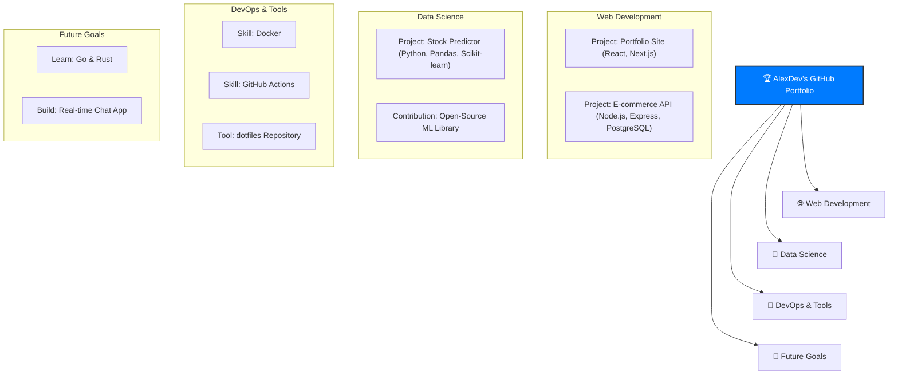

# 👋 Hi, I'm Flames

🚀 **Full Stack Developer | Automation Specialist | Product Designer**

I’m passionate about crafting **beautiful, functional, and impactful** digital experiences — from **web and mobile apps** to **automation systems** that save people hours of work. I blend design thinking with strong technical execution, and I’m always exploring ways to solve real-world problems with code.

---

## 🔥 What I Do

💻 **Web & Mobile Development**  
- MERN / Flutter / Node.js / React / Supabase / PostgresSQL 
/ MongoDB / MySQL / React Native / PHP / Laravel  
- Mobile Applications, Progressive Web Apps, scalable APIs, and database-driven systems

🎨 **UI/UX Design**  
- Figma / Adobe XD / Miro / Jira 

⚙️ **Automation & AI Integration**  
- n8n, Make, Airtable  
- AI-driven personalization and analytics

---

## 🛠 Tech Stack

**Languages:**  
                

**Frameworks & Tools:**  
`React` `Node.js` `Express` `Flutter` `Supabase` `MongoDB` `TailwindCSS` `n8n` `Firebase` `MySQL` `React Native` `Laravel`

**Design & Collaboration:**  
`Adobe Suite` `Notion` `Slack` `Trello`

---

### My Developer Mind Map

Here's a visual overview of my skills and projects.

## 📌 Featured Projects

- **🏠 Housing Platform (P2P + Escrow)** – A secure property rental/purchase system with KYC verification & Supabase backend.  
- **🍔 Buka Food Ordering App** – Flutter + Node.js with QR-based menu and real-time order tracking.  
- **🤖 AI Booking Agent** – Voice-enabled booking assistant using Twilio, GPT, and real-time transcription.  
- **📊 Lead Generation Automation Tool** – AI-powered cold email automation with tracking and follow-ups.  

*(More in my repos — feel free to explore!)*

## 📊 GitHub Stats & Activity

    

  

---

---

## 📫 Let’s Connect

- **Portfolio:** [Coming Soon 🚧]  
- **LinkedIn:** [https://www.linkedin.com/in/ugo-nelson-757811246/]
- **Twitter:** [https://x.com/Flames_js]
- **Email:** donflames@gmail.com

---

💡 _"Technology should solve problems, not create them."_  
Let’s build something amazing together.
